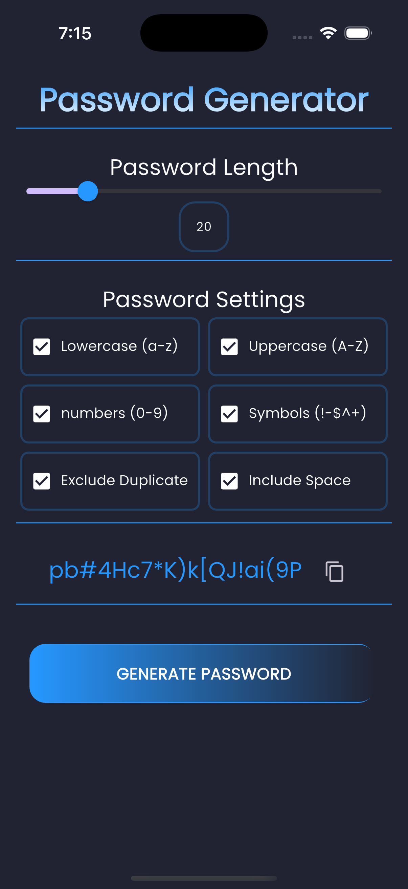
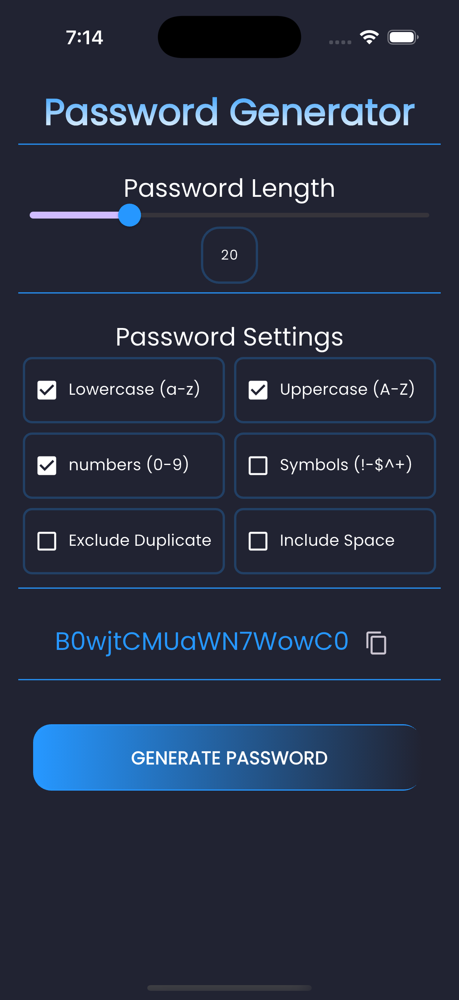

# password_generator

A new Flutter project.

## Getting Started

This project is a starting point for a Flutter application.

A few resources to get you started if this is your first Flutter project:

- [Lab: Write your first Flutter app]
- [Cookbook: Useful Flutter samples]

    
    
    

For help getting started with Flutter development, view the
[online documentation], which offers tutorials,
samples, guidance on mobile development, and a full API reference.

